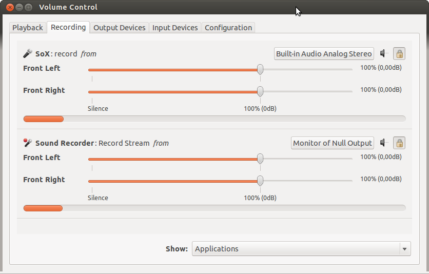

# sound & voice changes

### just try this out, if you get a microphone and headphones

```bash
sudo apt install ffmpeg sox pavucontrol libsox-fmt-pulse -y
```

#

hear yourself
```bash
# activate
pactl load-module module-loopback latency_msec=100
# deactivate
pactl unload-module module-loopback
```

#

fun with sox
```bash
sox -d -d pitch -700 contrast 100 echo 0.9 0.9 5 0.6
```
#

### cange audio from video

```bash
# separate audio from the video
ffmpeg -i input_video.mp4 output_audio.wav
# change trhe voice
sox output_audio.wav output_audio_changed.wav pitch -100
# combine them back
ffmpeg -i input_video.mp4 -i output_audio_changed.wav -c:v copy -c:a aac output_video_changed_voice.mp4
```


## how to voice change at apps

1. Install some necessary software:
```bash
sudo apt-get install sox libsox-fmt-pulse pavucontrol
```

2. Make a null-sink in pulseaudio:
```bash
pactl load-module module-null-sink
```
3 .Start sox recording from the default recording device (default source) and outputing to the the null-sink
```bash
sox -t pulseaudio default -t pulseaudio null pitch -700 #contrast 100
```
sox -d -d pitch -700 contrast 100 echo 0.9 0.9 5 0.6
(If you don't want to record from the default source, change the above command accordingly.) The -800 in the above command is the desired pitch change, you can modify that value as you want, e.g. -300, +200, +500, etc. . sox also have some other "effects" other than pitch changing which can be applied to the audio, you may want to check those out in man sox.
4. Start your capturing program (Skype, Teamspeak, etc.).

5. Start pavucontrol. at new bash session
```bash
pavucontrol
```
6. While you capturing program is trying to capture it will show up in pavucontrol under the Recording tab. Change its recording source from the default to Monitor of Null Output.



7. Check the results, it should be working.

<a href="https://askubuntu.com/questions/421947/is-there-a-way-to-modulate-my-voice-on-the-fly">source of it</a>
